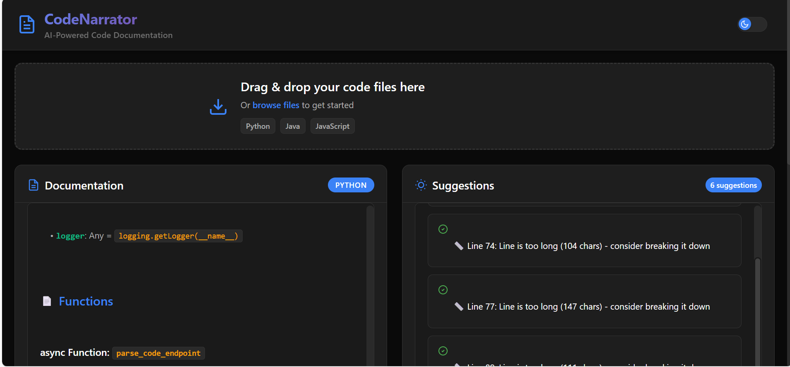
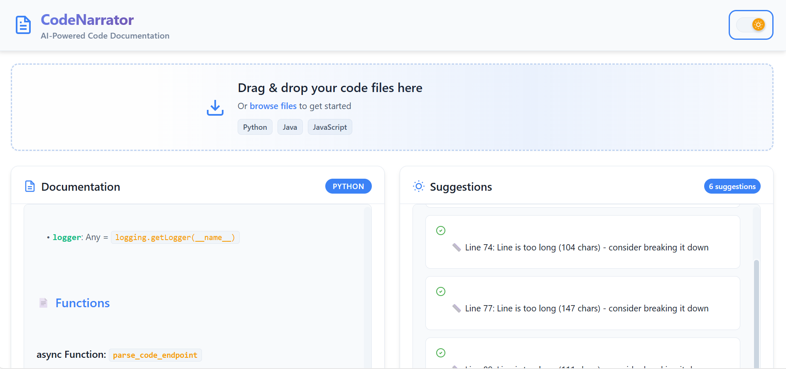

# 📚 AutoDoc - Code Narrator

> **An intelligent tool designed to automate the generation of high-quality documentation directly from source code.**

AutoDoc empowers developers by reducing the manual effort required to maintain documentation, while also improving code readability, maintainability, and collaboration. Simply upload your code files and get instant, well-structured documentation with intelligent suggestions for improvements.


## 📸 Screenshots

<div align="center">
  <table>
    <tr>
      <td width="50%">
        
        <p><strong>Dark Theme Main Interface</strong></p>
      </td>
      <td width="50%">
        
        <p><strong>Light Theme Main Interface</strong></p>
      </td>
    </tr>
  </table>
</div>


## ✨ Features

- 🚀 **Instant Documentation Generation** - Upload code files and get markdown documentation in seconds
- 🧠 **AI-Powered Suggestions** - Receive intelligent refactoring and improvement suggestions
- 📊 **Multi-Language Support** - Python, Java, and JavaScript/JSX support
- 📁 **Recent Files Management** - Easy access to previously processed files
- 💾 **Export Options** - Download documentation as Markdown or HTML
- 🌙 **Dark/Light Theme** - Modern UI with theme switching
- 📱 **Responsive Design** - Works seamlessly on desktop and mobile
- ⚡ **Real-time Processing** - Fast code analysis and documentation generation

## 🛠️ Tech Stack

### Frontend


### Backend


### Development Tools


## 🚀 Quick Start

### Prerequisites

Make sure you have the following installed:
- **Python 3.7+** 🐍
- **Node.js 14+** and **npm** 📦
- **Git** 🔧

### 📥 Clone the Repository

```bash
git clone https://github.com/Abhishek-5455/Code-Narrator.git
cd Code-Narrator
```

### 🔧 Backend Setup

1. **Create and activate a virtual environment:**
   ```bash
   python -m venv venv
   
   # On Windows
   venv\Scripts\activate
   
   # On macOS/Linux
   source venv/bin/activate
   ```

2. **Install Python dependencies:**
   ```bash
   pip install -r requirements.txt
   ```

3. **Start the FastAPI backend server:**
   ```bash
   cd backend
   python main.py
   ```
   
   The backend server will be running at `http://localhost:8000`

### 🎨 Frontend Setup

1. **Navigate to the frontend directory:**
   ```bash
   cd frontend/autodoc-frontend
   ```

2. **Install Node.js dependencies:**
   ```bash
   npm install
   ```

3. **Start the React development server:**
   ```bash
   npm start
   ```
   
   The frontend will be running at `http://localhost:3000`

## 📖 Usage

1. **Open your browser** and navigate to `http://localhost:3000`
2. **Upload a code file** (.py, .java, .js, .jsx) using the upload interface
3. **View generated documentation** in the documentation panel
4. **Review suggestions** for code improvements in the suggestions panel
5. **Access recent files** from the recent files section to regenerate documentation
6. **Export documentation** as Markdown or HTML files

## 🔗 API Endpoints

| Method | Endpoint | Description |
|--------|----------|-------------|
| `GET` | `/` | API status and available endpoints |
| `POST` | `/parse-code/` | Upload code file and generate documentation |
| `POST` | `/suggest/` | Generate refactoring suggestions |
| `GET` | `/files/recent` | Get list of recently processed files |
| `GET` | `/files/{file_id}` | Get specific cached file content |
| `GET` | `/files/{file_id}/download` | Download cached file |
| `DELETE` | `/files/{file_id}` | Delete specific cached file |
| `GET` | `/docs` | Interactive API documentation (Swagger) |

## 📂 Project Structure

```
AutoDoc/
├── backend/                 # FastAPI backend
│   ├── main.py             # Main FastAPI application
│   ├── models/             # Data models
│   ├── parser/             # Language-specific parsers
│   ├── services/           # Business logic services
│   └── suggestor/          # Code suggestion generators
├── frontend/autodoc-frontend/  # React frontend
│   ├── public/             # Static assets
│   ├── src/
│   │   ├── components/     # React components
│   │   ├── App.js          # Main App component
│   │   └── index.js        # Entry point
│   └── package.json        # Frontend dependencies
├── requirements.txt        # Python dependencies
└── README.md              # Project documentation
```

## 🤝 Contributing

We welcome contributions! Please follow these steps:

1. **Fork the repository**
2. **Create a feature branch:** `git checkout -b feature/amazing-feature`
3. **Commit your changes:** `git commit -m 'Add some amazing feature'`
4. **Push to the branch:** `git push origin feature/amazing-feature`
5. **Open a Pull Request**

### Development Guidelines

- Follow Python PEP 8 style guide for backend code
- Use ESLint and Prettier for frontend code formatting
- Write clear commit messages
- Add tests for new features
- Update documentation as needed

## 📋 Supported File Types

| Language | Extensions | Features |
|----------|------------|----------|
| **Python** | `.py` | Classes, functions, docstrings, imports |
| **Java** | `.java` | Classes, methods, Javadoc comments |
| **JavaScript** | `.js`, `.jsx` | Functions, classes, JSDoc comments |

## 🐛 Known Issues

- Large files (>10MB) may take longer to process
- Complex nested structures might need manual review
- Some edge cases in comment parsing

## 📞 Support

If you encounter any issues or have questions:

- 🐛 **Bug Reports:** [Open an issue](https://github.com/Abhishek-5455/Code-Narrator/issues)
- 💡 **Feature Requests:** [Create a feature request](https://github.com/Abhishek-5455/Code-Narrator/issues)
- 📧 **Contact:** [Your Email](mailto:your.email@example.com)

---

<div align="center">
  <strong>⭐ Star this repository if you find it helpful! ⭐</strong>
  <br>
  Made with ❤️ by <a href="https://github.com/Abhishek-5455">Abhishek-5455</a>
</div> 
